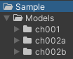
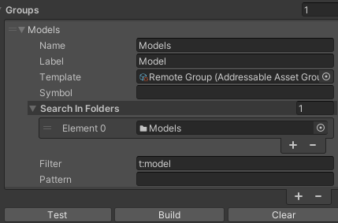
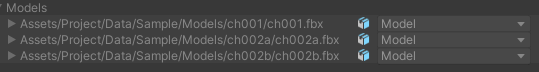
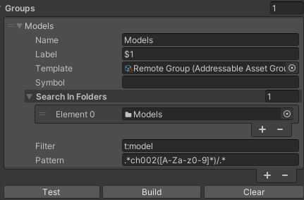
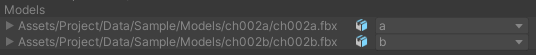

AddressableAssetGroupBuilder
===

About AddressableAssetGroupBuilder
---
This is a tool to easily create Group settings for Unity.Addressables.

You can set conditions as ScriptableObject assets and execute them at any time from the included button.

You can enumerate assets to be addressed from target folder assets, filters for FindAssets, and pattern matching using regular expressions, and assign them to an arbitrary group.

Labels can be defined for each asset, and the results of regular expressions can be used as variables.

Usage
--- 

[Create] -> [Addressables] -> [Group Builder]
to create the AddressableAssetGroupBuilder Asset.

Prepare the asset.

Set the parameters.

Press the "Build" button to create the group.

Press the "Clear" button to clear asset entries and labels.

Press the "Test" button to output asset entries with labels and own group.

You can enter a regular expression and use the result as a variable for the label.

