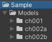
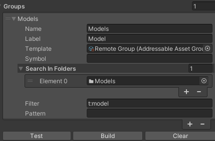
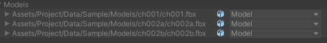
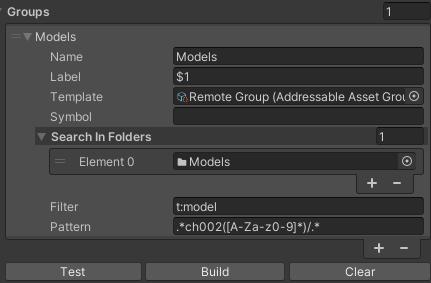
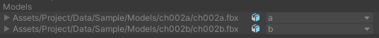

AddressableAssetGroupBuilder
===

About AddressableAssetGroupBuilder
---
This is a tool to easily create Group settings for Unity.Addressables.

You can set conditions as ScriptableObject assets and execute them at any time from the included button.

You can enumerate assets to be addressed from target folder assets, filters for FindAssets, and pattern matching using regular expressions, and assign them to an arbitrary group.

Labels can be defined for each asset, and the results of regular expressions can be used as variables.

Usage
--- 

[Create] -> [Addressables] -> [Group Builder]
to create the AddressableAssetGroupBuilder Asset.

Prepare the asset.

Set the parameters.

Press the "Build" button to create the group.

Press the "Clear" button to clear asset entries and labels.

Press the "Test" button to output asset entries with labels and own group.

You can enter a regular expression and use the result as a variable for the label.

Auto Addressing
---
Enable `Auto Addressing` on exactly one `Group Builder Batch` asset.
Imported, moved and deleted assets are then addressed incrementally by an `AssetPostprocessor`,
using the same rules as the Build button (later builders / groups win when several match).

* Only the changed assets are touched; unused labels and groups are cleaned up by a full Build only.
* Large changes are processed incrementally across editor updates, up to 500 changed / removed paths per update (configurable via `AutoAddressing.MaxAssetsPerUpdate`, minimum 1). Auto Addressing never falls back to a full Build.
  This is a path-count limit, not a time budget; lower it if a chunk takes too long in your project. It replaces the former `FullBuildThreshold` setting.
* Pending changes survive Domain Reload within the current editor session. Processing pauses during compilation, imports, Play Mode, or a manual Build, and resumes when available. Pending work is retained while Auto Addressing is disabled; new changes made while disabled are not collected. Closing the editor clears pending work.
* Changing a Builder / Batch definition does not rebuild existing entries. Press "Build" to synchronize existing entries.
* Per user on/off: `Tools > Addressable Group Builder > Auto Addressing` (EditorPrefs). Disabled in batch mode.
* Requires Unity 2021.3+ / Addressables 1.19+. The `Dynamic` address naming mode has been removed.

UPM
--- 
**https://github.com/yassy0413/AddressableAssetGroupBuilder.git**
